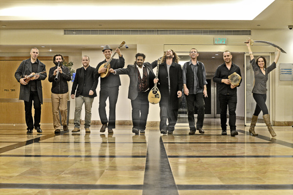

להקה שמחה סוחפת מרקידה ומרגשת -צוענית ,יוונית, מרוקאית , ישראלית מוזיקת עולם, מוזיקה מקורית בעיבודים חדשים מרעננים ועדכניים לכל הלהיטים המוכרים

 הרכב מקצועי המונה בין 6 ל9 נגנים מהשורה הראשונה בארץ ובעולם, עם נסיון במה של למעלה מ 20 שנה בהופעות באירועים פרטיים ועסקיים

ההרכב נוסד על ידי אורי שפי מוזיקאי ומלחין מעבד ונגן כלי מיתר מהעולם (עוד כינור בוזוקי לירה כרתית) עם טובי המוזיקאים(נסים דקוואר, מארק אליהו ,התזמורת האנדלוסית ,עמאד דלאל ,ליאור אלמליח , אייל שילוח……)
אודי בן כנען  מוזיקאי  ונגן כלי מיתר משובח (לירה כרתית , בוזוקי , גיטרה , סאז , רבאב אפגני ) יסד להקות רבות ועבד עם גדולי המוזיקאים (שבע , מטבוחה פרוגקט ,דיוואן סאז …..)   שניהם נגנים ומפיקים מוזיקליים מובילים בתחומם.

אנחנו ביאמאס מתחייבים להגשים לכם את האירוע בדיוק כמו שחלמתם … 
   אפשרות לשלב רקדניות , נגנים אורחים מיוחדים ,  dj שיתאים לאירוע , קבלות פנים מלכותיות , פתרונות הגברה ותאורה מהטובים שיש …