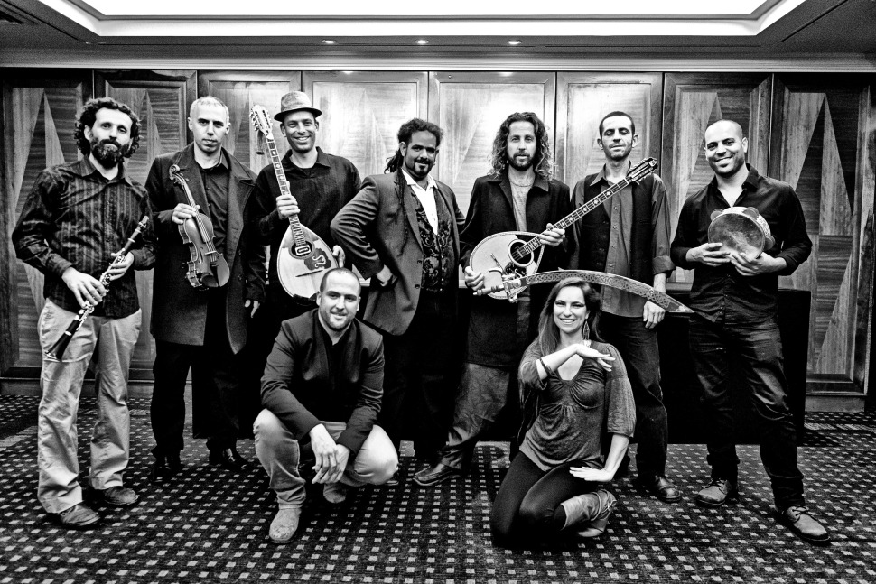
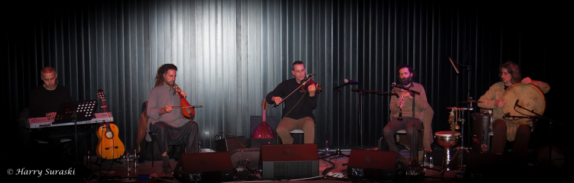

# Yamas

הרכב המונה בין 6 ל 9 נגנים מהשורה הראשונה עם אפשרות לשלב רקדניות , נגן חמת חלילים , זמרים , כנרים ועוד  , DJ שיתאים לאירוע ו

הרכב שמח סוחף ובעל הופעה מרשימה ווירטואוזית עם רפרטואר עשיר ומגוון
  (…צועני ,בלקני ,יווני ,ערבי ,טורקי ,תימני ,מרוקאי ,ועוד)

נגנים מנוסים מאד מקצועיים ובעלי יכולות מרשימות , הרכב

שיתאים לכל אירוע ויתן מענה ושירות ברמה המקצועית הגבוהה ביותר

הופעות במה גדולות, חתונות ,ארועים פרטיים ועסקיים

…פסטיבלים ועוד

# טריו מוזיקת עולם

המשלב כלים ייחודים ומסורתיים

עוד , קאנון , כינור , לירה כרתית , סאז , כלי הקשה מן המזרח ,רבאב אפגני ועוד

מופע סוחף ומרגש המביא איתו צבעים וניחוחות מארצות המזרח התיכון טורקייה יוון פרס מצריים מרוקו אלג'יר ואפגניסטן

לקבלות פנים ארועי חברות ארועים פרטיים והופעות

# טריו טברנה יווני

ניחוחות יוון וכרתים , מוזיקת רבטיקו סירטו וריקודים

טריו שיגרום לכם לזוז ויקח אתכם למחוזות יוון והאיים הקסומים

מוזיקה אינסטרומנטלית המנוגנת על בוזוקים לירה כרתית כינור וקלידים

מיועד לטברנות, קבלות פנים, ארועים פרטיים ועסקיים ,הופעות במה ועוד

#Masik – מסיק

מוזיקה אינסטרומנטלית מקורית, יצירות שנכתבו על ידי המוזיקאי ונגן כלי המיתר אורי שפי (עוד , כינור ,לירה ובוזוקי) בהרכב פסנתר ,לירה כרתית , גיטרה, כלי הקשה, קאנון וכלי נשיפה

ההרכב משלב השפעות גליליות והשפעות מטורקיה ויוון

 הרכב מונה חמישה נגנים עם אופציה לשבעה

מוזיקה וירטואוזית עמוקה ובעלת רבדים וצבעים רבים מנוגן על ידי נגנים מהשורה הראשונה בעלי ניסיון של למעלה מ 20 שנה ,סאונד וכלים ברמה גבוהה, והופעה שהיא מסע קסום המתחיל מאהבה למוזיקה עובר דרך השקט שבין הצלילים ונוגע במהות.

מיועד להופעות במה ,קונצרטים , היכלי תרבות , קבלות פנים ,פסטיבלים וחו"ל

#קוורטט ג'אז איכותי

המורכב ממתופף בסיסט קלידן וגיטריסט מהשורה הראשונה

הרכב ברמה גבוהה לקבלות פנים חתונות ארועים פרטיים ועסקיים מלונות ועוד

 
